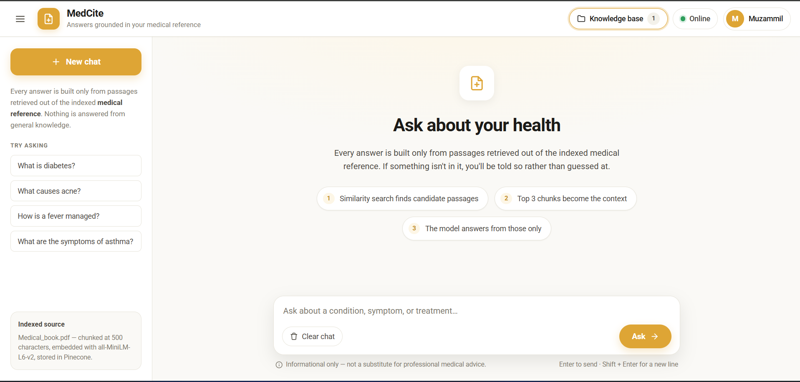

<div align="center">

# MedCite

**A medical question-answering chatbot that answers only from documents you index.**

Retrieval-Augmented Generation over a medical reference PDF — Flask, LangChain
Pinecone, and a Groq-hosted LLaMA model.

<br>



</div>

---

## Table of contents

- [What it does](#what-it-does)
- [Interface](#interface)
- [How it works](#how-it-works)
- [Tech stack](#tech-stack)
- [Project structure](#project-structure)
- [Getting started](#getting-started)
- [Environment variables](#environment-variables)
- [Running locally](#running-locally)
- [Deploying to Vercel](#deploying-to-vercel)
- [Configuration reference](#configuration-reference)
- [Troubleshooting](#troubleshooting)
- [Known limitations](#known-limitations)
- [Roadmap](#roadmap)

---

## What it does

You point MedCite at a medical PDF. It splits the document into chunks, embeds
them, and stores the vectors in Pinecone. When a user asks a question, MedCite
retrieves the passages closest to that question and hands only those passages to
the language model as context.

The model is instructed to answer from that context and to say it does not know
when the context does not cover the question. Answers stay tethered to the
source material instead of the model's general training.

---

## Interface

The UI has no build step — vanilla CSS, inline SVG icons, jQuery from a CDN.
Brand color `#DEA535`, typeface Roboto.

| Region | What it holds |
| --- | --- |
| Header | Wordmark, indexed-document count, connection status |
| Sidebar | New chat, an explanation of the grounding rule, starter questions, and the indexed source with its chunking parameters |
| Empty state | The three retrieval steps a question actually goes through |
| Composer | Auto-growing input — Enter sends, Shift + Enter adds a line — plus the medical disclaimer |

The sidebar collapses from the hamburger and auto-hides below 860 px. Model
output is inserted as a text node, never interpolated into HTML.

---

## How it works

The project has two independent pipelines that share one contract: **the
embedding dimension and the index name must match on both sides.**

### Ingestion — `store_index.py` (run once, locally)

```
data/*.pdf
   │  load_pdf_file()            DirectoryLoader + PyPDFLoader
   ▼
Document[]
   │  filter_to_minimal_docs()   keep only metadata={"source": ...}
   ▼
Document[]  (minimal)
   │  text_split()               RecursiveCharacterTextSplitter
   │                             chunk_size=500, chunk_overlap=20
   ▼
chunks
   │  download_hugging_face_embeddings()
   │                             all-MiniLM-L6-v2, local → 384 dims
   ▼
Pinecone index "medical-chatbot"
   dimension=384 · metric=cosine · serverless aws/us-east-1
```

### Query — `app.py` (runtime)

```
Browser (templates/chat.html)
   │  POST /get   form field: msg
   ▼
Flask route chat()
   ▼
rag_chain = create_retrieval_chain(retriever, question_answer_chain)
   │
   ├─ retriever   PineconeVectorStore.from_existing_index(...)
   │              .as_retriever(search_type="similarity", k=3)
   │              embeddings: HFInferenceEmbeddings (HTTP, 384 dims)
   │              → 3 chunks injected as {context}
   │
   └─ question_answer_chain = create_stuff_documents_chain(chatModel, prompt)
          prompt     ChatPromptTemplate [ system_prompt(+{context}), human {input} ]
          chatModel  ChatGroq(GROQ_MODEL, temperature=0.4)
   ▼
response["answer"]  →  plain string  →  rendered in the chat UI
```

### Why two different embedding paths

Both paths use the **same model and the same 384 dimensions**, but reach it
differently:

| Path | Where | How embeddings are computed | Why |
| --- | --- | --- | --- |
| Ingestion | Your machine | `sentence-transformers` locally | Fast, free, runs offline over thousands of chunks |
| Query | Flask / Vercel | HuggingFace Inference API over HTTP | `torch` is ~2 GB; a Vercel function is capped at 250 MB |

This is why dependencies are split across two requirements files.

---

## Tech stack

| Layer | Choice |
| --- | --- |
| Language | Python 3.12 |
| Web framework | Flask 3.1 |
| Orchestration | LangChain 0.3 (`create_retrieval_chain`, `create_stuff_documents_chain`) |
| Vector store | Pinecone (serverless, aws/us-east-1) |
| Embeddings | `sentence-transformers/all-MiniLM-L6-v2` — 384 dims |
| LLM | Groq-hosted LLaMA (configurable via `GROQ_MODEL`) |
| Frontend | Vanilla CSS + jQuery, Roboto, brand `#DEA535` |
| Hosting | Vercel (Python runtime, WSGI) |

---

## Project structure

```
MedCite/
├── app.py                  # Flask app + RAG chain — Vercel entrypoint, no app.run()
├── run_local.py            # Development server (local only)
├── store_index.py          # One-off ingestion script (local only)
├── setup.py                # Package metadata
│
├── requirements.txt        # RUNTIME deps — what Vercel installs
├── requirements-dev.txt    # INGESTION-only deps (torch, pypdf)
│
├── vercel.json             # Function config: 60s timeout, excluded files
├── .vercelignore           # Keeps data/ and venv/ out of the bundle
├── .python-version         # Pins Python 3.12
│
├── .env                    # Secrets — never committed
├── .env.example            # Template
│
├── docs/
│   └── screenshot.png      # README image
│
├── data/
│   └── Medical_book.pdf    # Source corpus (not deployed)
│
├── src/
│   ├── __init__.py
│   ├── helper.py           # PDF load, metadata filter, chunking, local embeddings
│   ├── embeddings_api.py   # HTTP embeddings for the deployed runtime
│   └── prompt.py           # system_prompt
│
├── templates/
│   └── chat.html           # Chat UI
└── static/
    ├── style.css
    └── favicon.svg
```

---

## Getting started

### Prerequisites

- Python 3.12
- A Pinecone account
- A Groq account
- A HuggingFace account (free read token)
- One or more medical PDFs in `data/`

### Install

```bash
git clone https://github.com/muzammilhussain45/Medical-Chatbot-with-Langchain.git
cd Medical-Chatbot-with-Langchain

python -m venv venv
venv\Scripts\activate            # Windows
source venv/bin/activate         # macOS / Linux

pip install -r requirements.txt -r requirements-dev.txt
```

`requirements-dev.txt` is only needed on the machine that runs ingestion. A
deployment installs `requirements.txt` alone.

---

## Environment variables

Copy the template and fill it in:

```bash
cp .env.example .env
```

| Variable | Required | Used by | Where to get it |
| --- | --- | --- | --- |
| `PINECONE_API_KEY` | Yes | ingestion + runtime | [app.pinecone.io](https://app.pinecone.io) → API Keys |
| `GROQ_API_KEY` | Yes | runtime | [console.groq.com/keys](https://console.groq.com/keys) |
| `HUGGINGFACEHUB_API_TOKEN` | Yes | runtime | [huggingface.co/settings/tokens](https://huggingface.co/settings/tokens) — type **Read** |
| `GROQ_MODEL` | No | runtime | Defaults to `llama-3.3-70b-versatile` |
| `PINECONE_INDEX_NAME` | No | runtime | Defaults to `medical-chatbot` |
| `RETRIEVER_TOP_K` | No | runtime | Defaults to `3` |
| `LLM_TEMPERATURE` | No | runtime | Defaults to `0.4` |
| `HF_EMBED_URL` | No | runtime | Override if HuggingFace moves its endpoint |

`.env` is git-ignored. Never commit it.

---

## Running locally

### 1. Build the index — once

```bash
python store_index.py
```

Parses the PDFs, chunks them, embeds every chunk locally, creates the Pinecone
index if missing, and upserts. Takes several minutes on first run — the
embedding model downloads (~90 MB) before any work starts.

> **This script is not idempotent.** Running it twice upserts the same chunks
> again under new IDs, producing duplicates. Delete and recreate the index
> before re-ingesting.

### 2. Start the server

```bash
python run_local.py
```

> `app.py` contains no `app.run()` call. Vercel executes it during the build to
> find the WSGI `app` object, so a server started there would hang the deploy.
> `run_local.py` is the development entrypoint; Vercel never uses it.

| Route | Purpose |
| --- | --- |
| `GET /` | Chat interface |
| `GET /health` | Returns index name and active model — check config without asking a question |
| `POST /get` | Form field `msg` → plain-text answer |

Open <http://localhost:8080>.

---

## Deploying to Vercel

Vercel detects Flask automatically from `app.py` exporting a top-level `app`.

1. **Push to GitHub.** Confirm `.env` is not in the commit.
2. **Import the repo** at [vercel.com/new](https://vercel.com/new). Leave build
   and output settings empty.
3. **Add environment variables** before the first deploy — Production, Preview
   and Development:

   ```
   PINECONE_API_KEY
   GROQ_API_KEY
   HUGGINGFACEHUB_API_TOKEN
   GROQ_MODEL
   ```

4. **Deploy**, then hit `/health` first. JSON back means the environment loaded
   correctly; a 500 means a variable is missing.

### What makes the deployment fit

A Vercel function is capped at **250 MB unzipped**. Three things keep MedCite
under it:

- `requirements.txt` excludes `torch`, `sentence-transformers` and `pypdf`
- `vercel.json` `excludeFiles` drops `data/`, `venv/` and every PDF
- `.vercelignore` keeps the same paths out of the upload

Re-indexing always happens on your machine, never on Vercel.

---

## Configuration reference

Where to change behavior:

| Change | File |
| --- | --- |
| Persona, answer length, refusal behavior | `src/prompt.py` |
| Chunk size / overlap | `src/helper.py` → `text_split()` |
| Embedding model ⚠ also change index dimension | `src/helper.py`, `src/embeddings_api.py`, `store_index.py` |
| Retrieved chunk count, search type | `RETRIEVER_TOP_K` env var, or `app.py` |
| LLM provider / model / temperature | `GROQ_MODEL`, `LLM_TEMPERATURE`, or `app.py` |
| Index name, cloud, region | `PINECONE_INDEX_NAME` env var; region in `store_index.py` |
| UI, colors, typography | `templates/chat.html`, `static/style.css` |

---

## Troubleshooting

| Symptom | Cause | Fix |
| --- | --- | --- |
| `TypeError: str expected, not NoneType` | No `.env`, or a key is blank | Create `.env` from `.env.example` |
| `groq.NotFoundError: model does not exist or you do not have access` | Model ID retired, or not enabled on your account | List available models with your key, then set `GROQ_MODEL` |
| `HuggingFace embedding request failed` | Endpoint moved, or token invalid | Verify the token; set `HF_EMBED_URL` to the current endpoint |
| Answers are irrelevant | Index empty or built with a different embedding model | Check the vector count in the Pinecone console; rebuild if dimensions differ |
| `LangChainDeprecationWarning` on startup | `HuggingFaceEmbeddings` imported from the old path | Harmless. See the roadmap item below |
| Vercel build fails on function size | A heavy package leaked into `requirements.txt` | Keep torch and friends in `requirements-dev.txt` |

---

## Known limitations

Documented deliberately — these are real, not oversights:

1. **No conversation memory.** Every request is independent; the chain holds no
   history. Follow-up questions are not resolved against earlier turns.
2. **No source citations yet.** The retrieved documents are available on
   `response["context"]` but are not surfaced in the response or the UI.
3. **Answers are returned as a raw string,** not JSON. The frontend inserts them
   as text nodes, so model output is never parsed as markup.
4. **`store_index.py` is not idempotent** — re-running duplicates chunks.
5. **`data/Medical_book.pdf` is 16 MB and committed to git,** which makes a
   fresh clone heavy.
6. **This is not clinical advice.** MedCite is a demo over one reference book.
   The UI carries a disclaimer; keep it.

---

## Roadmap

- Surface `response["context"]` sources and page numbers in the UI — the feature
  the name promises
- Multi-turn memory via `create_history_aware_retriever` and a session store
- Streaming responses through `rag_chain.stream(...)` and SSE
- Move `HuggingFaceEmbeddings` to `langchain_huggingface`
- Centralize the remaining hard-coded constants in `src/config.py`
- Multi-PDF upload that calls the ingestion pipeline as a reusable function
- An evaluation set — RAGAS, or a fixed list of golden questions

---

<div align="center">
<sub>MedCite · Informational only · Not a substitute for professional medical advice</sub>
</div>
